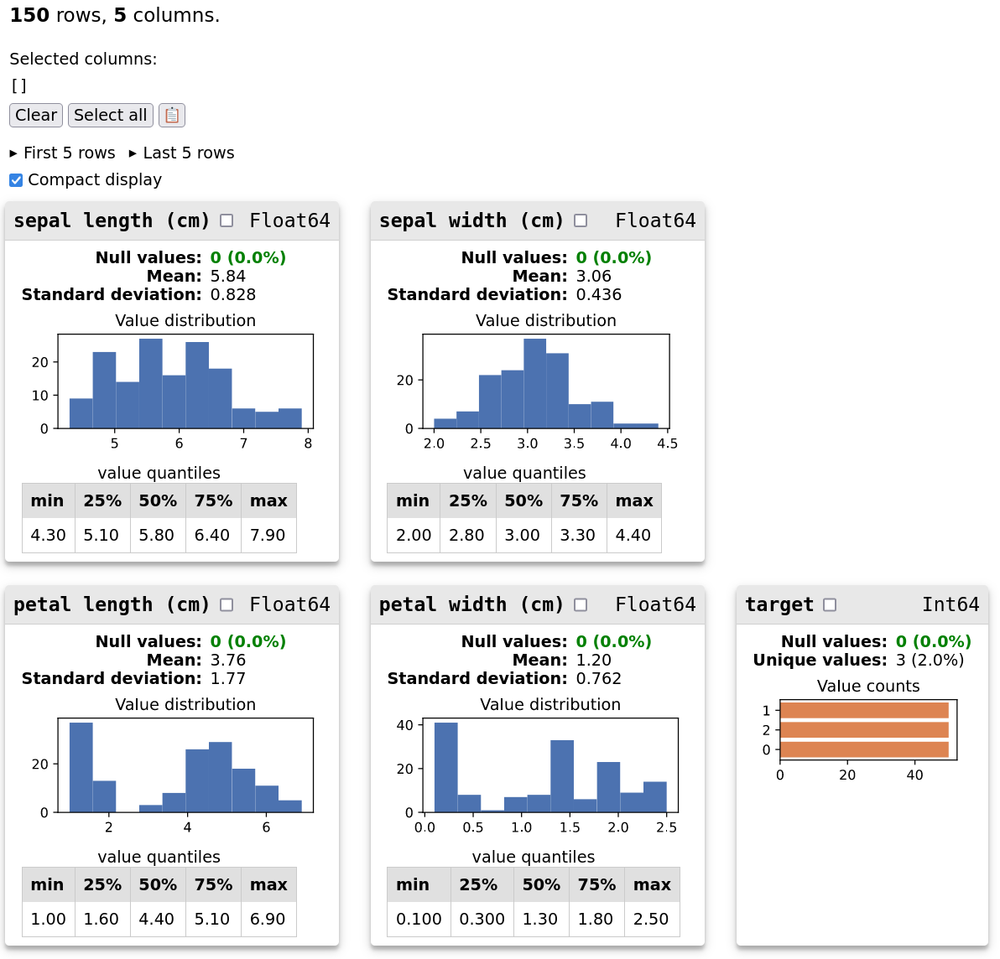

# Prototyping dataframe visualization tools

This package exists to experiment with ideas and features that could be included in [skrub](https://github.com/skrub-data/skrub).
As the goal is quick prototyping and experimentation, some features are likely to be incomplete or dysfunctional.

See [some example reports](https://skrub-data.org/skrubview/).
Any feedback is very welcome.

## Installing

`skrubview` is not available on PyPI nor conda-forge.
It must be installed by downloading the latest source code.
Either in one go:

```
pip install git+https://github.com/skrub-data/skrubview.git
```

Or by cloning the repository:

```
git clone git@github.com:skrub-data/skrubview.git
pip install ./skrubview
```

## Usage

```python
from sklearn.datasets import load_iris
from skrubview import Report

df = load_iris(as_frame=True)["frame"]
Report(df).open()
```



Note: the screenshot above is outdated.

`Reports` can be initialized with either a dataframe (pandas or polars) or a file path.
They should display nicely in a jupyter notebook or ipython shell.
They have `html`, `text`, and `json` attributes representing their content in those formats.

## Command-line usage

```bash
skrubview ./my_file.parquet --open
```

See `skrubview -h` for options.
